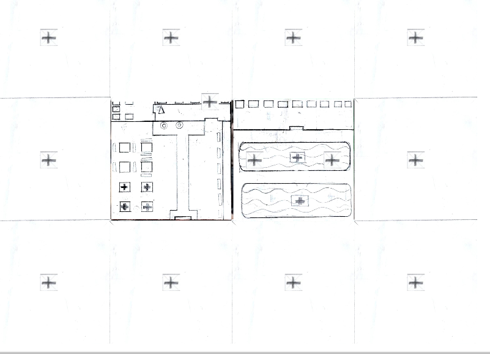
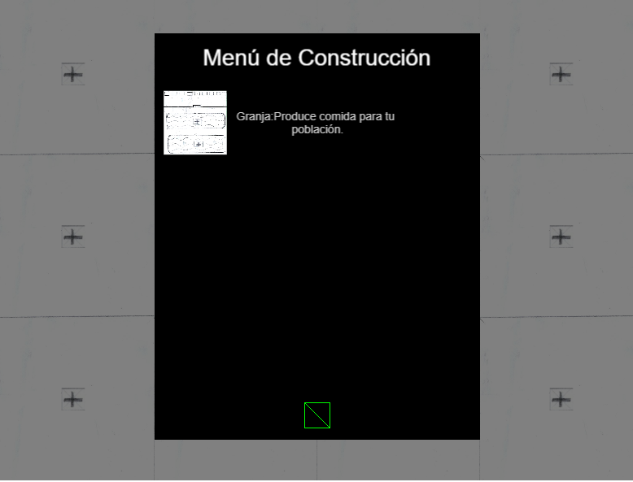
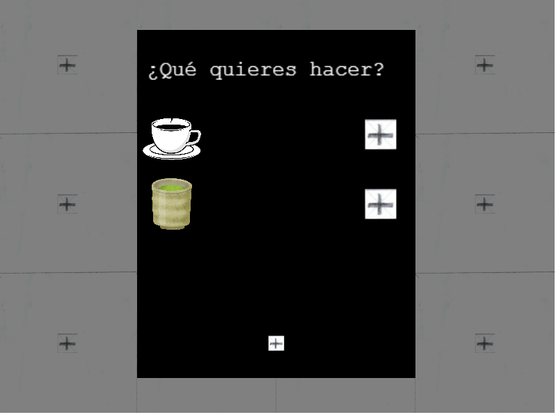

# Far Away From Tea

> *Trabajo universitario desarrollado como parte de la asignatura de 2º año Programación de Videojuegos en Lenguajes Interpretados, en la Universidad Complutense de Madrid.*

---

## Descripción general

Te encargas de gestionar y expandir una cafetería, construyendo nuevos edificios para conseguir materias primas y producir una gran variedad de productos que los clientes
te pedirán durante el día. Mejorarás los edificios y conseguirás nuevos trabajadores que te ayudarán a ser más eficiente en tu objetivo de convertirte en la cafetería más
famosa del mundo.

Genero: Construcción de bases y gestión de recursos. Con vista top-down.

---

## Características principales

● Gestión de recursos
● Construcción de edifi cios para producir y procesar recursos.
● Venta de productos a los clientes.
● Mejora de popularidad y expansión de la base.
● Estética pixel art en 2D y atmósfera amigable y sencilla
● Especial importancia en la gestión efi ciente de la cafetería para crecer lo más rápido posible..

---

## 📸 Capturas del juego

|  |  |  |

---

## Enlace a la versión publicada

Puedes jugar o ver la versión publicada del juego en el siguiente enlace:

👉 **[Jugar ahora](https://link10804k.github.io/PVLI-Grupo02/)**  

---

## 📱 Redes sociales (opcional)

Sigue el proyecto o contacta con nosotros en:

-  [Twitter]([https://twitter.com/tucuenta](https://x.com/GamesMatcha))

---

## 👥 Autores

- [Adrian Arbas Perdiguero] — [@Macarr0n](https://github.com/Macarr0n)
- [Javier Zazo Morillo] — [link10804k](https://github.com/link10804k)
- [Jorge Augusto Blanco Fernandez] — [JorgeDoge](https://github.com/JorgeDoge)
- [Vicente Rodriguez Casado] — [vicenku2002](https://github.com/vicenku2002)

---

## 🧾 Licencia

Este proyecto se distribuye bajo la licencia de Matcha Game.  
